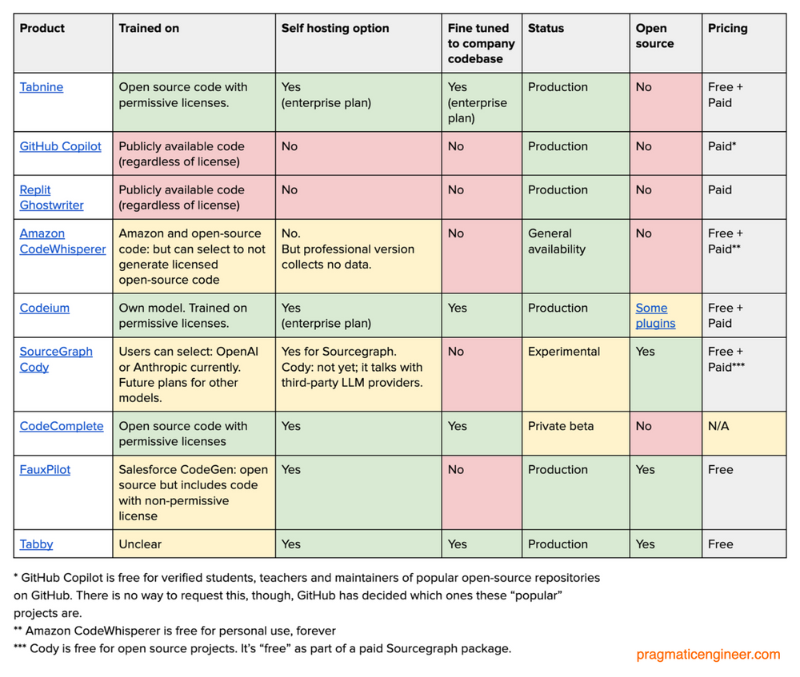

# <span style="color:#F97B22">Blogging Web App</span>

## <span style="color:#F97B22">Overview</span>

This project focuses on prompt-based [Next.js](https://nextjs.org/learn) web app development, leveraging AI assistants like [GitHub Copilot](https://github.com/features/copilot) and [Tabnine](https://www.tabnine.com/getting-started) to expedite code completion and enhance development productivity.

### <span style="color:#F97B22">Objective</span>

The main objective of this project is to utilize AI-powered tools to streamline the development process of Next.js web applications. By harnessing the capabilities of GitHub Copilot/Tabnine, developers aim to enhance code completion and reduce manual coding efforts.

#### <span style="color:green">1. What is Github Copilot?</span>

- Github Copilot is an AI-powered code completion tool developed by Github in collaboration with OpenAI.
- It utilizes machine learning models to assist developers in writing code by suggesting whole lines or blocks of code based on the context and code patterns.
- It is designed to improve developers' productivity by automating repetitive coding tasks and reducing the time spent on searching for documentation or examples.
- With Copilot, developers can get intelligent code suggestions for various programming languages and frameworks, making it a versatile tool for a wide range of projects.

#### <span style="color:green">2. How to Use Github Copilot?</span>

- To use Github Copilot, you need to subscribe to Github Copilot, install the Github Copilot extension in your preferred code editor, such as Visual Studio Code.
- Once installed, Copilot integrates seamlessly into your coding workflow.
- As you write code, Copilot automatically suggests completions based on the code context and patterns.
- It provides suggestions for entire lines of code, function definitions, variable names, and more. You can accept or reject these suggestions by simply pressing the Tab key or using other keyboard shortcuts.

Here's an example of how Copilot can assist with code completion:

```python
## Example 1: Function Definition
def calculate_average(numbers):
    """
    Calculates the average of a list of numbers.
    """
    total = sum(numbers)
    avg = total / len(numbers)
    return avg

## Example 2: Code Block
if condition:
    # Copilot suggests completing the code block based on the condition
    do_something()
    do_another_thing()
    # ...

```

### <span style="color:green">3. Free/Paid Versions</span>

<span style="color:violet">[Github Copilot](https://github.com/features/copilot#pricing)</span> **subscription-based pricing model**.

- <span style="color:green">Enterprise - $19/user/Month</span>
- <span style="color:orange">Personal - $10/Month.</span>
- <span style="color:orange">Personal - $100/Year.</span>

<span style="color:violet">[Tabnine](https://www.tabnine.com/pricing)</span> **subscription-based pricing model**.

- <span style="color:green">[Enterprise : TBD](https://www.tabnine.com/pricing)</span>
- <span style="color:orange">Basic Personal - $0/Month</span>
- <span style="color:orange">Pro Personal - $12/Month</span>

### <span style="color:green">4. Limitations/Risks/Vulnerabilities</span>

While Github Copilot is a powerful tool, it does come with certain limitations and potential risks:

- **AI Pair Programmer**: It assits in coding but does not create something new.

- **Code Sharing**: Local, hybrid, Cloud : Its upto the developers for trusting the assistant on privacy

- **Quality of Generated Code**: The code suggestions provided by Copilot are based on patterns it has learned from vast code repositories. However, the quality of the generated code may vary, and manual review is essential to ensure correctness and adherence to project requirements.

- **License and Legal Considerations**: Copilot may generate code snippets that include copyrighted or licensed code. It is crucial for developers to review and modify the generated code to comply with applicable licenses and legal requirements.

- **Security Vulnerabilities**: Copilot's suggestions are based on patterns in existing code, which may include security vulnerabilities or insecure practices. Developers should exercise caution and perform proper security testing and code review to mitigate any potential vulnerabilities.

### <span style="color:green">5. Advantages</span>

Github Copilot offers several advantages to developers, including:

- **Logic and Syntax Predictions** : Code completion, logic analysis, alternatives and debugging are all available with github copilot.

- **Unit Test Cases** : Code completion, logic analysis, alternatives and debugging are all available with github copilot.

- **Improved Productivity**: Copilot speeds up the coding process by providing accurate code suggestions, reducing the time spent on repetitive tasks and searching for examples.

- **Learning and Knowledge Transfer**: Copilot can introduce developers to new coding patterns, best practices, and libraries through its generated suggestions, enabling learning and knowledge transfer within the development team.

- **Reduced Cognitive Load**: By automating code completion, Copilot helps reduce the cognitive load on developers, allowing them to focus more on the logic and higher-level aspects of their code.

| Name                                                                                            | Id                                   | Description                                                                                                                                                     | Version  | Publisher           | Marketplace                                                                                      |
| ----------------------------------------------------------------------------------------------- | ------------------------------------ | --------------------------------------------------------------------------------------------------------------------------------------------------------------- | -------- | ------------------- | ------------------------------------------------------------------------------------------------ |
| Tabnine AI Autocomplete for Javascript, Python, Typescript, PHP, Go, Java, Ruby & more          | TabNine.tabnine-vscode               | JavaScript, Python, Java, Typescript & all other languages - AI Code completion plugin. Tabnine makes developers more productive by auto-completing their code. | 3.6.56   | TabNine             | [Link](https://marketplace.visualstudio.com/items?itemName=TabNine.tabnine-vscode)               |
| GitHub Copilot                                                                                  | GitHub.copilot                       | Your AI pair programmer                                                                                                                                         | 1.89.156 | GitHub              | [Link](https://marketplace.visualstudio.com/items?itemName=GitHub.copilot)                       |
| Blackbox AI Code Generation, Code Chat, Code Search                                             | Blackboxapp.blackbox                 | Code as fast as you think                                                                                                                                       | 1.0.21   | BLACKBOX AI         | [Link](https://marketplace.visualstudio.com/items?itemName=Blackboxapp.blackbox)                 |
| Codeium: AI Coding Autocomplete and Chat for Python, Javascript, Typescript, Java, Go, and more | Codeium.codeium                      | The modern coding superpower: free AI code acceleration plugin for your favorite languages. Type less. Code more. Ship faster.                                  | 1.2.36   | Codeium             | [Link](https://marketplace.visualstudio.com/items?itemName=Codeium.codeium)                      |
| Cody AI by Sourcegraph                                                                          | sourcegraph.cody-ai                  | AI code assistant that writes code and answers questions for you                                                                                                | 0.2.3    | Sourcegraph         | [Link](https://marketplace.visualstudio.com/items?itemName=sourcegraph.cody-ai)                  |
| CodeComplete                                                                                    | CodeComplete.codecomplete-vscode     |                                                                                                                                                                 | 0.0.8    | CodeComplete        | [Link](https://marketplace.visualstudio.com/items?itemName=CodeComplete.codecomplete-vscode)     |
| AWS Toolkit (Includes Codewhisperer)                                                            | AmazonWebServices.aws-toolkit-vscode | Including support for CodeWhisperer, CodeCatalyst, Lambda, S3, CloudWatch Logs, and many other services                                                         | 1.77.0   | Amazon Web Services | [Link](https://marketplace.visualstudio.com/items?itemName=AmazonWebServices.aws-toolkit-vscode) |
| Fauxpilot                                                                                       | Venthe.fauxpilot                     | Get completions from Fauxpilot server                                                                                                                           | 1.1.5    | Venthe              | [Link](https://marketplace.visualstudio.com/items?itemName=Venthe.fauxpilot)                     |
| Tabby                                                                                           | TabbyML.vscode-tabby                 | Get completions from Tabby server                                                                                                                               | 0.0.6    | TabbyML             | [Link](https://marketplace.visualstudio.com/items?itemName=TabbyML.vscode-tabby)                 |

transform data from CSV format to JSON/XML format using a specified logic built upon the command/specification document.

## <span style="color:#FBD9B0">Note</span>

### ChatGPT uses your input via the web interface to train its model. This is how Samsung employees leaked confidential data by asking ChatGPT to generate meeting notes. ChatGPT retains user data, even that of paying users. If you don’t consent to this, you need to opt out.

### Comparision(https://blog.pragmaticengineer.com/github-copilot-alternatives/)



## <span style="color:green">Yet to explore</span>

- <span style="color:#F97B22">Logic build up using command/specification document</span>
- <span style="color:#FEE8B0">Format Transformation from csv to JSON/XML</span>
- <span style="color:#9CA777">Logging and exception handling with command on the code</span>
